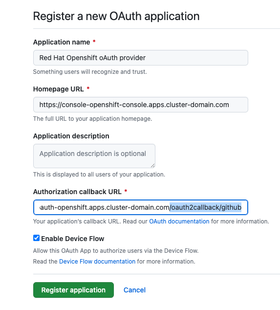
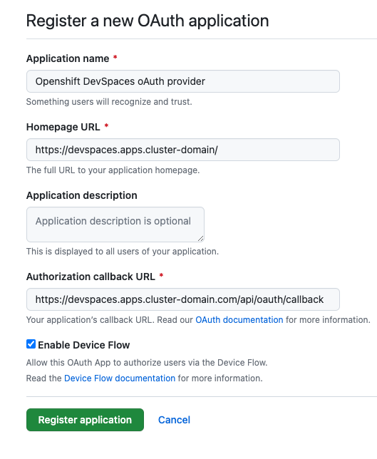
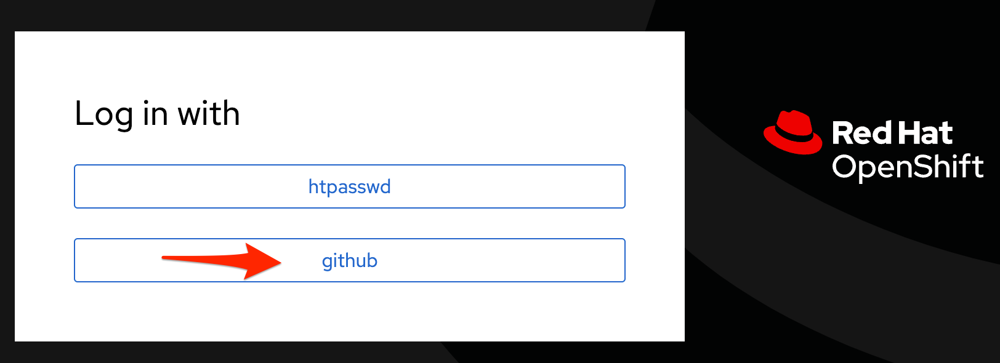

# Openshift Dev Workflows Gitops Cluster Bootstrap

This project repo contains a set of ArgoCD manifests used to bootstrap a Openshift Cluster v4.x using GitOps approach. The produced environment is intended for Developer workflows demo.

It uses the ArgoCD **App of Apps pattern** to pre-install and configure a set of Openshift Operators to support Developer Workflows.

The following components should be provisioned by ArgoCD in your cluster:

 * **Openshift Pipelines**
 * **Container Security Operator**
 * **Crunchy Postgres Operator**
 * **Openshift Devspaces**
 * **Hyperfoil.io Load Driver Operator**
 * **Kubernetes Image Puller Operator**
 * **Openshift Serverless (Knative Serving)**
 * **Patch Operator**
 * **Service Binding Operator (SBO)**
 * **Sonatype Nexus**
 * **...** (this list keeps growing as I need to add new components to my demos)

# First things first
If you got a "naked cluster" with just the `kubeadmin` system user. You can start by enabling the `htpasswd` auth provider and creating the `admin` user by using the `bootstrap-scripts/enable-htpasswd-users.sh`. 

This script will create the `admin` user as `cluster-admin` and 5 other regular (non-admin) users.

# Openshift GitOps installation
You can choose to install **Openshift GitOps** Operator manually from the Operator Hub using the Openshift Console (Administrator Perspective) or you can

 1. Authenticate as a `cluster-admin` on your cluster

```shell
oc apply -f ./openshift-gitops-install/operator.yaml

#wait until the Gitops operators is ready
oc wait pods -n openshift-operators -l control-plane=controller-manager --for condition=Ready=false
oc apply -f ./openshift-gitops-install/argocd.yaml
```

 2. Apply additional `ClusterRoleBindings` to ArgoCD Controller Service Accounts

```shell
oc apply -f ./openshift-gitops-install/rbac.yaml
```

> **IMPORTANT**: Make your cluster admin(s) ArgoCD Admins (already done if you use the `bootstrap-scripts/enable-htpasswd-users.sh`)
```shell
oc adm groups new cluster-admins <your admin username here>
```

## Bootstrapping the components provisioning though Openshift GitOps (ArgoCD)
After installing Openshift GitOps you can go ahead and create the **Argo Apps of Apps** using

```shell
oc apply -f root-app/app-of-apps.yaml
```

After applying this manifest go to the ArgoCD web console and watch the provisioning.
> **IMPORTANT**: It will take a while to have all components provisioned and in healthy state. The provisioning happens in "waves". You may have to refresh od sync come apps in case they remain in unhealthy state.


# Enabling Github oAuth provider
I use this repo to bootstrap an Openshift Cluster to showcase Openshift Dev Tooling and Developer workflows on top of Openshift Platform.
For this I like to integrate Openshift and Openshift DevSpaces with Github. 

To enable github users to authenticate on Openshift and DevSpaces using their Github accounts you need to configure Github oAuth. 

## Enabling Github users (developers) to access Openshift

 * Go to https://github.com/account/organizations/new?plan=free and create a new Github Personal Org"
 * Fill the fields with:
   * Organization Account Name: 'my-openshift-dev-team'
   * Contact email: 'your email address'
   * Check  'My personal account' for the Organization type


> **IMPORTANT:** After creating your Personal Org, make sure you add members to it (including yourself)
> Go to https://github.com/orgs/your-org-name/people and invite/add members


 * Now go to https://github.com/settings/applications/new and create a new GitHub app
 * Fill the fields with:
   * Application Name: `Red Hat Openshift oAuth provider`
   * Homepage URL: `https://console-openshift-console.apps.cluster-domain.com/`
   * Authorization callback URL: `https://oauth-openshift.apps.cluster-domain.com/oauth2callback/github`

> **IMPORTANT:** <mark>Remember to copy the Client Id and the Client Secret values</mark>



## Configuring Github oAuth for DevSpaces

 * Now go to https://github.com/settings/applications/new and create another GitHub app (now for DevSpaces)
 * Fill the fields with:
   * Application Name: `Openshift DevSpaces oAuth provider`
   * Homepage URL: `https://devspaces.apps.cluster-domain.com/`
   * Authorization callback URL: `https://devspaces.apps.cluster-domain.com/api/oauth/callback`

> **IMPORTANT:** <mark>Remember to copy the Client Id and the Client Secret values</mark>



## Applying the Github oAuth configuration to your Openshift cluster

With the Github Org and oAuth Apps properly created, now is time to apply the required configuration in your cluster. 

**To make things easy I created a script to guide you in this configuration. Just execute the `bootstrap-scripts/setup-github-oauth.sh` and follow the instructions.**

> **NOTE:** After you create the github secrets the Patch Operator will catch the secret `ocp-github-app-credentials` (should be present in the `openshift-config` namespaces) and automatically configure the Cluster oAuth resource for you. 

In a couple of seconds you should be able to access the cluster using Github as an Identity Provider.


